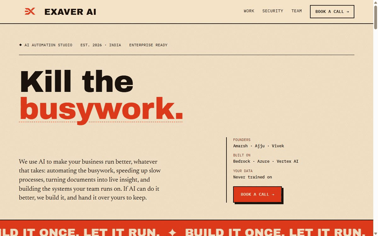
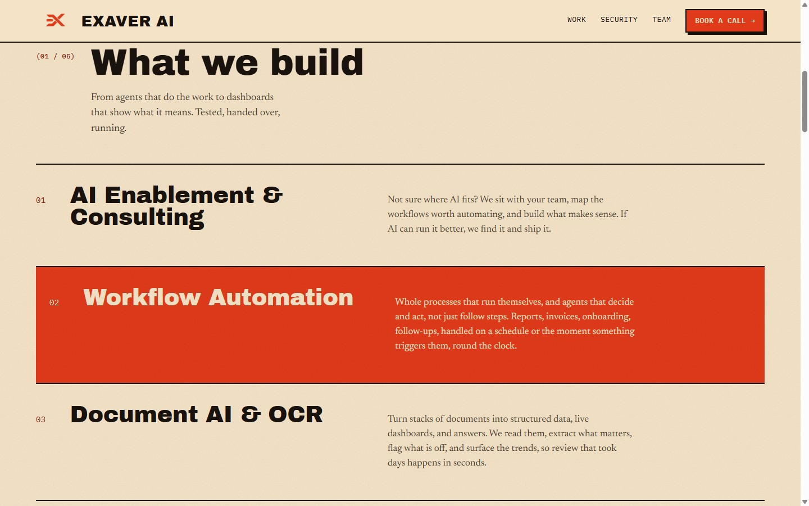
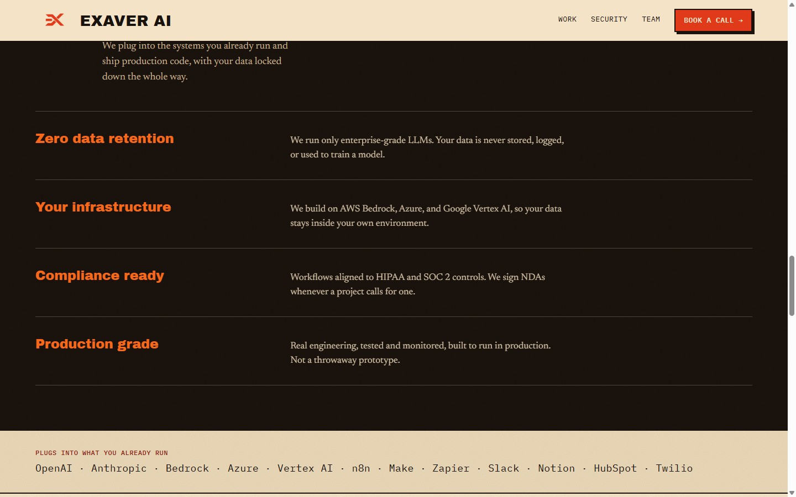
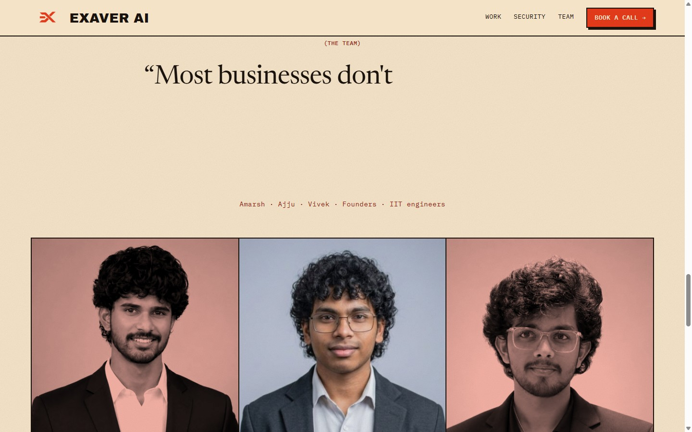
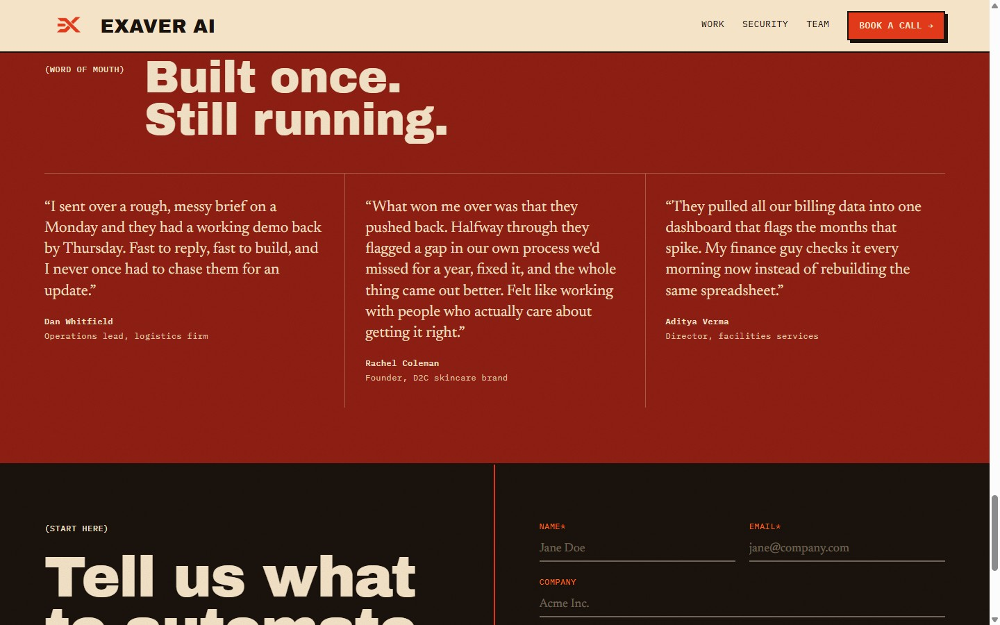
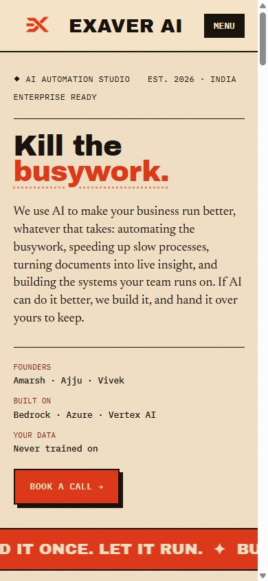

# Exaver AI — Studio Website

The marketing site for **Exaver AI**, an AI automation studio. Concept, design, copy, build, testing, and launch — done end to end by **[Amarsh](https://github.com/amarshp)**, one of the three founders.

### → Live at **[exaverai.com](https://exaverai.com)**



---

## The brief I set myself

I wanted the site to feel like a **real design studio built it, not a template.** No stock SaaS hero, no cookie-cutter rounded cards, no generic gradient. I pulled the identity straight from our logo and committed to a warm, editorial, poster-style direction — big display type, hard-edged panels, a molten vermilion accent, and motion that earns its place.

Everything here is intentional. Here's what I prioritized:

- **A distinctive point of view.** A warm editorial system (Archivo Black · Newsreader · IBM Plex Mono on a bone-and-ink palette) that reads as a brand, not a framework. I stress-tested it against the "AI-generated template" look until it stopped feeling generic.
- **Motion with purpose.** Service rows that light up under the cursor even mid-scroll, a pipeline that runs like a signal, panels that drop in and lift back out as you scroll, a headline that types itself. Tasteful, and none of it can jank or freeze.
- **Works everywhere.** Fully responsive, tested down to the phone — hero, grids, forms, and animations all hold up on small screens.
- **Fast.** Zero framework, static HTML/CSS/JS. Photos optimized from ~3 MB down to ~80 KB with no visible loss.
- **A real conversion path.** Working Calendly booking and a contact form that reliably reaches the inbox.
- **Findable & machine-readable.** Rich structured data, an `llms.txt`, an on-brand social-share card, and clean SEO — so search engines *and* AI agents understand what we do.
- **Iterated hard.** Every section went through rounds of design, self-review, and testing before it shipped.

---

## A look around

| | |
|---|---|
|  |  |
| **What we build** — a numbered editorial index, no cards | **Serious about your data** — panels that drop in on scroll |
|  |  |
| **The team** — a self-typing quote + duotone founder portraits | **Word of mouth** — an oxblood flood section |

<p align="center">
  
  <br/>
  <em>Responsive down to the phone.</em>
</p>

---

## Under the hood (kept simple)

- **Static** HTML / CSS / JavaScript — no framework, no build step.
- **Type:** Archivo Black, Newsreader, IBM Plex Mono.
- **Motion:** hand-written CSS animations + a little vanilla JS (IntersectionObserver, scroll-synced hover).
- **Hosting:** Vercel, with Web Analytics.
- **Contact:** Calendly for booking, Formspree for the form.

## Structure

```
exaverai/        The live site (static) — deployed by Vercel
  index.html     Markup
  styles.css     Editorial design system
  app.js         Interactions
  llms.txt       Machine-readable brief for AI agents
docs/            Screenshots + scroll capture for this README
```

---

**Designed and built by Amarsh.** Ideation, art direction, copywriting, front-end, QA, and launch.
Live at **[exaverai.com](https://exaverai.com)**.
